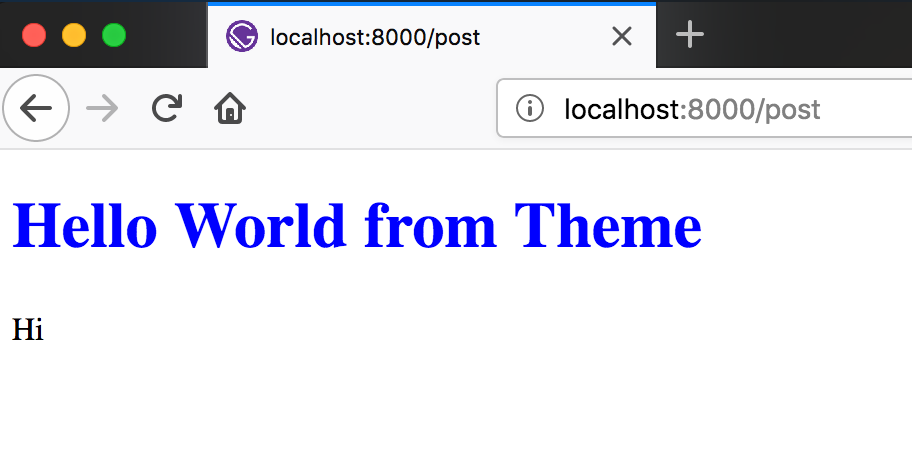
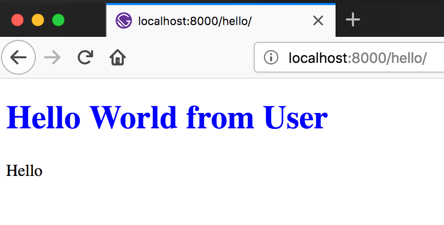
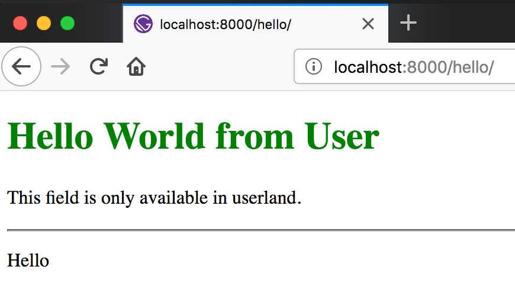

Gatsby has been gaining so much traction for the past few months. When I was first introduced to Gatsby, there was only 3 official starters as well as a handful of others. Nowaday, we have a showcase of starters with many different combination of CMSs and UI libraries integration. Things are great and dandy, yet I still feel like something is missing. Having built several sites in Gatsby, I find myself installing the same packages, setting up page creation, or adding some configuration again and again. It's repetitive and tedious. There are rooms for improvement.

Recently, [Chris Biscardi](https://twitter.com/chrisbiscardi) from the Gatsby team introduced [Gatsby Theme](https://www.gatsbyjs.org/blog/2018-11-11-introducing-gatsby-themes/#why-themes), allowing users to reuse the same configuration across multiple sites. This definitely is a game changer for many people. It allows the already-exciting ecosystem of Gatsby starters to become even more reusable. It can also let newcomers to utilize Gatsby without much traction.

Super excited about the new feature, I've been playinng around with it for some time. Here is how you can get started with Gatsby Theme:

**NOTE**: _Theme is an experimental feature. You may want to consider that before using it for any serious project._

## What we're gonna build

We're going to set up a simple blog with Gatsby using markdown files. We can then make it into a theme. You will see how easy it will be for theme-user to leverage theme's functionality to create websites.

We'll also poke around some current pattern that theme developers can use to allow further customization from users.

## Set up the blog

I'll speed through the initial set up of the blog as I assume you are already familiar with Gatsby.

First, we'll use Yarn Workspaces to set this up. Let's create a new directory and set up our workspace:

```sh
mkdir gatsby-theme-tutorial
cd gatsby-theme-tutorial
```

```json
// in package.json
{
  "name": "gatsby-theme-tutorial",
  "version": "1.0.0",
  "license": "MIT",
  "private": true,
  "workspaces": ["packages/*"]
}
```

We'll start from `gatsby-starter-hello-world`.

```sh
mkdir packages
gatsby new packages/gatsby-theme-tutorial https://github.com/gatsbyjs/gatsby-starter-hello-world
```

Let's create the blog post:

```md
<!-- in packages/gatsby-theme-tutorial/src/pages/post.md -->

---

title: "Hello World from Theme"
slug: "post"

---

Hi
```

Add some necessary packages to transform it into Gatsby data

```sh
# in packages/gatsby-theme-tutorial/
# let's also upgrade to the latest gatsby version at this time
yarn add gatsby@^2.0.56 gatsby-source-filesystem gatsby-transformer-remark
```

```js
// in packages/gatsby-theme-tutorial/gatsby-config.js

module.exports = {
  plugins: [
    {
      resolve: "gatsby-source-filesystem",
      options: {
        path: "src/pages",
        name: "pages",
      },
    },
    "gatsby-transformer-remark",
  ],
}
```

Now let's turn markdown files into a page on our blog:

```js
// in packages/gatsby-theme-tutorial/gatsby-node.js

const path = require("path")

exports.createPages = ({ graphql, actions }) => {
  const { createPage } = actions

  return new Promise(resolve => {
    resolve(
      graphql(
        `
          {
            posts: allMarkdownRemark {
              edges {
                node {
                  frontmatter {
                    slug
                  }
                }
              }
            }
          }
        `,
      ).then(({ data: { posts } }) => {
        posts.edges.map(({ node: { frontmatter: { slug } } }) => {
          createPage({
            path: slug,
            component: path.resolve(__dirname, "src/templates/PostTemplate.js"),
            context: { slug },
          })
        })
      }),
    )
  })
}
```

```jsx
// in packages/gatsby-theme-tutorial/src/templates/PostTemplate.js

import React from "react"
import { graphql } from "gatsby"
import Title from "../components/Title"

function PostTemplate({ data: { post } }) {
  return (
    <div>
      <Title>{post.frontmatter.title}</Title>
      <div dangerouslySetInnerHTML={{ __html: post.html }} />
    </div>
  )
}

export default PostTemplate

export const pageQuery = graphql`
  query($slug: String!) {
    post: markdownRemark(frontmatter: { slug: { eq: $slug } }) {
      html
      frontmatter {
        title
      }
    }
  }
`
```

```jsx
// in packages/gatsby-theme-tutorial/src/components/Title.js

import React from "react"

function Title({ children }) {
  return <h1 style={{ color: "blue" }}>{children}</h1>
}

export default Title
```

That should be it for the blog. Let's try and see if it's working:

```sh
# in workspace root
yarn
yarn workspace gatsby-theme-tutorial start
```

If you can navigate to [localhost:8000/post](localhost:8000/post) and see this, everything is going well so far. 🎉



## Make it a theme

## Use it

Let's create another Gatsby site and consume the theme we just create. And yes, that's right. We didn't have to do anything special. At its core, a theme is just a regular Gatsby site.

```sh
# in workspace root

# to utilize yarn workspace, the module needs to have an index.js
touch packages/gatsby-theme-tutorial/index.js

gatsby new packages/blog https://github.com/gatsbyjs/gatsby-starter-hello-world

yarn workspace blog add gatsby-theme-tutorial@1.0.0
```

And create a blog post:

```md
<!-- in packages/gatsby-theme-tutorial/src/pages/hello.md -->

---

title: "Hello World from User"
slug: "hello"

---

Hello
```

Let's try and run it:

```sh
yarn workspace blog start
```

And voila:



It's that easy!! Using themes, users can just focus on their content and don't have to worry about the code.

## Customization

### 1. Override UI components

As great as any theme can be, there will always be something that we want to change.

In this case, we're using an awesome theme already, but let's say we don't like the color of the title. This blue is not very good, and we want something better. Let's recreate the title component:

```jsx
// in packages/blog/src/components/Title.js
// let's change the color from blue -> green

import React from "react"

function Title({ children }) {
  return <h1 style={{ color: "green" }}>{children}</h1>
}

export default Title
```

Save, and see the magic happens.

...

Hmm well nothing happened. The title's color is still blue. That's because we haven't set up the theme to do anything with customization just yet. So let's get on it then:

```jsx
// in packages/gatsby-theme-tutorial/src/templates/PostTemplate.js

// ...

// instead of importing Title directly from components folder
// let's import it like this

// import Title from "../components/Title"
import Title from "gatsby-theme-tutorial-component-replacement--components/Title"

// ...
```

Now, set up aliases so that if the users want to override the `Title` component, they can:

```js
// in packages/gatsby-theme-tutorial/gatsby-node.js

// ...
const fs = require("fs")
const pkg = require("./package.json")

// ...

exports.onCreateWebpackConfig = ({ actions }) => {
  // This is the folder that the replacement components will sit
  const themePrefix = `${pkg.name}-component-replacement--components`
  const userComponentsDir = path.resolve(`./src/components/${themePrefix}`)

  const userComponents = {}

  // Check if user wants to set up components replacements
  if (fs.existsSync(userComponentsDir)) {
    fs.readdirSync(userComponentsDir).forEach(fileName => {
      // Remove ext (.js) from file name
      const componentName = fileName.slice(0, fileName.lastIndexOf("."))

      userComponents[`${themePrefix}/${componentName}`] = path.resolve(
        `./src/components/${themePrefix}/${fileName}`,
      )
    })
  }

  actions.setWebpackConfig({
    resolve: {
      alias: {
        // Alias order matters. User's first; fallback second
        ...userComponents,
        [themePrefix]: path.join(__dirname, "./src/components"),
      },
    },
  })
}
```

And lastly, move our new-and-improved `Title` component to the replacement folder:

```sh
# in packages/blog/src/components
mkdir gatsby-theme-tutorial-component-replacement--components
mv Title.js gatsby-theme-tutorial-component-replacement--components/
```

Run the site again, and this time you should see our title in green.

### 2. Override Gatsby template

Now, let's say we want to change the `PostTemplate`. We may need to change the layout of the page, or we may want to have some extra fields in our post. We can totally achieve all these like so:

We'd use a utility function `withThemePath` that check if users want to override the template. The concept is quite similar to what we've done earlier, but the solution is a lot more elegant. This function can be found in the package `gatsby-theme`, so let's install it in our theme:

```sh
# in packages/gatsby-theme-tutorial

yarn add gatsby-theme
```

```js
// in packages/gatsby-theme-tutorial/gatsby-node.js

// ...
const { withThemePath } = require("gatsby-theme")

// ...
createPage({
  path: slug,
  // component: path.resolve(__dirname, "src/templates/PostTemplate.js"), // highlight-line
  component: withThemePath("src/templates/PostTemplate.js"), // highlight-line
  context: { slug },
})
// ...
```

With this change, if the user has an override for `PostTemplate`, the theme will use it instead of its own template. Let's create it then:

```jsx
// in packages/blog/src/templates/PostTemplate.js

import React from "react"
import { graphql } from "gatsby"
import Title from "gatsby-theme-tutorial-component-replacement--components/Title"

function PostTemplate({ data: { post } }) {
  return (
    <div>
      <Title>{post.frontmatter.title}</Title>
      {/* highlight-start */}
      <p>{post.frontmatter.description}</p>
      <hr />
      {/* highlight-end */}
      <div dangerouslySetInnerHTML={{ __html: post.html }} />
    </div>
  )
}

export default PostTemplate

export const pageQuery = graphql`
  query($slug: String!) {
    post: markdownRemark(frontmatter: { slug: { eq: $slug } }) {
      html
      frontmatter {
        title
        description # highlight-line
      }
    }
  }
`
```

**NOTE**: _To be frank, this doesn't seem like the best options yet since we'll have to copy-paste the original `PostTemplate` from theme and adjust it. I believe we will be able to solve this problem in the future and come up with a more elegant solution. In the mean time, there are ways for themes developer to go around this with some API pattern. I'll elaborate more in future posts._

Don't forget to add the `description` field in our post:

```md
<!-- in packages/gatsby-theme-tutorial/src/pages/hello.md -->

---

title: "Hello World from User"
slug: "hello"
description: "This field is only available in userland." <!-- add description field -->

---

<!-- ... -->
```

This should do the trick. Try running the blog, and you should see:



And there you have it, a fully customizable theme. As you can see, using theme makes it super easy to get started and utilize all the functionality of the theme. At the same time, users are still in control of their website and have the ability to change and customize it as they see fit.

## Publish

Before publishing the theme to NPM, there is one last step we have to do. As we're not compiling the code of the theme when publishing, we have to instruct Gatsby to utilize the build process of users' site. Without doinng so, there may be errors when we utilize language features like JSX.

```js
// in packages/gatsby-theme-tutorial/gatsby-node.js

// ...

actions.setWebpackConfig({
  resolve: {
    alias: {
      // Alias order matters. User's first; fallback second
      ...userComponents,
      [themePrefix]: path.join(__dirname, "./src/components"),
    },
  },

  // highlight-start
  // Let Webpack know how to process files
  module: {
    rules: [
      {
        test: /\.js$/,
        include: path.dirname(require.resolve(pkg.name)),
        use: [loaders.js()],
      },
    ],
  },
  // highlight-end
})

// ...
```

That's it. Your theme is now ready to be published and reused.

## Final thoughts

I'm super excited about the direction that Gatsby is going towards. After testing out Gatsby theme, I can see that it allows the theme developer full control of what to exposed to the users. But above all, it gives developers the ability to reuse functionality and configuration quickly without boilerplates.

Gatsby theme helps developers create blazing fast websites blazingly fast.
